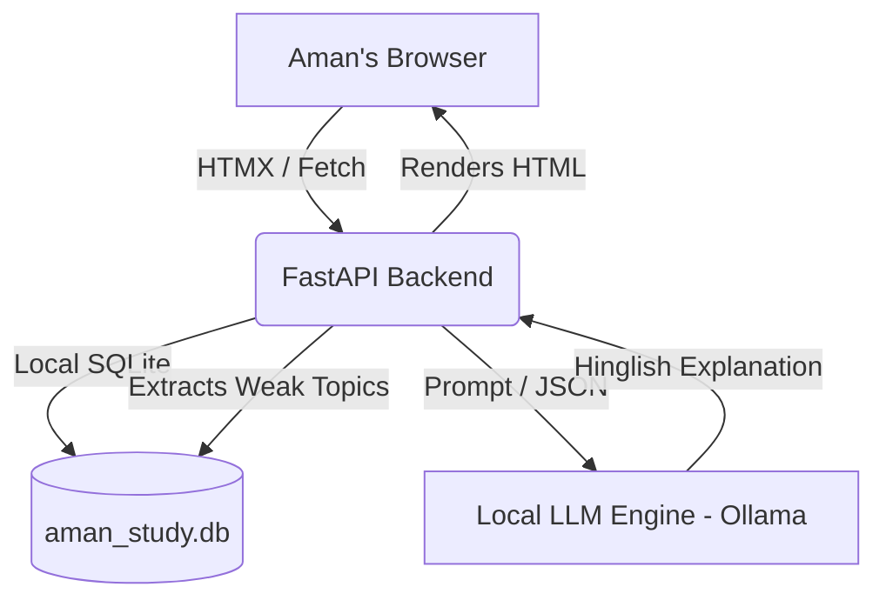

# PLAN: Aman's Offline Study Buddy

## User Story
**Aman (22)** is preparing for the SSC CGL 2027 exam on a shared family laptop with patchy internet. He takes mock tests but struggles to learn from his mistakes because the official solutions are in formal English. He needs an offline, fast, and friendly "study buddy" that explains his incorrect answers in informal, Roman-script Hinglish and tracks his weak topics over time. Because the laptop is shared, his data must remain private in local files.

## Scope
**MUST HAVE (Slice 1 - 48h Demo)**
- **Local AI Only**: Execution on 8GB RAM CPU via `Ollama` or `llama.cpp`.
- **Single Command Setup**: `make run` or `docker compose up`.
- **Core Loop**: Simple UI (FastAPI + HTMX) to paste a wrong question -> local LLM returns a Hinglish explanation.
- **Privacy & Tracking**: Local SQLite database to track wrong questions and extract/update "weak topics".
- **Swappability**: Easy model-swapping via config (e.g. change from Qwen to Llama).

**SHOULD HAVE**
- A "Topic Dashboard" showing his weak areas based on past mistakes.
- Markdown rendering in the UI for math/reasoning formulas.

**CUT (Out of Scope)**
- Cloud sync / User authentication.
- RAG over full textbooks.
- Heavy frontend frameworks (React/Next.js).
- Paid APIs.

## Architecture Diagram

## Model Choice Rationale
**Chosen Model**: Qwen2.5 1.5B (or 3B) / Llama 3.2 1B (or 3B) Quantized (Q4_K_M).
- **RAM Constraint**: Aman has an 8GB RAM CPU-only machine. A 1.5B-3B parameter model quantized to 4-bit uses ~1.5 - 2.5 GB RAM, leaving enough memory for the OS and browser without thrashing.
- **Language**: Qwen2.5 1.5B and Llama 3.2 1B excel at Hinglish and reasoning out-of-the-box compared to older models of similar size. 
- **Swappability**: We'll configure Ollama to serve `qwen2.5:1.5b` by default, but allow swapping to `llama3.2:1b` via a single `config.json` or `.env`.

## 6-Hour Milestone Breakdown
- **Milestone 1 (Hour 1-6): Foundation & Slice 1** 
  - Set up FastAPI + HTMX shell. Install Ollama. 
  - Build the core endpoint: Paste question -> Call local LLM -> Render Hinglish answer. 
  - *Goal: End-to-end ugly demo working.*
- **Milestone 2 (Hour 7-12): Data & Topic Tracking** 
  - Add SQLite. Save past mistakes. 
  - Build prompt to extract weak topics (e.g., "Time & Work", "Syllogism") from pasted questions. 
  - *Goal: Dashboard showing weak topics.*
- **Milestone 3 (Hour 13-18): Prompt Eng & Evals** 
  - Create `/prompts` and `/evals` directory. 
  - Collect 15 real SSC CGL mock questions. 
  - Run eval script across 2 models to measure Hinglish quality and reasoning. 
  - *Goal: Eval table generated for README.*
- **Milestone 4 (Hour 19-24): UX Polish & Voice (Stretch)** 
  - Refine UI for Aman (big buttons, clear errors, loading states, Hinglish copy). 
  - If ahead, add whisper.cpp for optional voice input.
- **Milestone 5 (Hour 25-30): Handover & Docs** 
  - Write handover kit (1-page Hinglish guide). 
  - Draft DEV Post (`post.md`). 
  - Finalize README.md with benchmarks (RAM, latency) and constraints.
