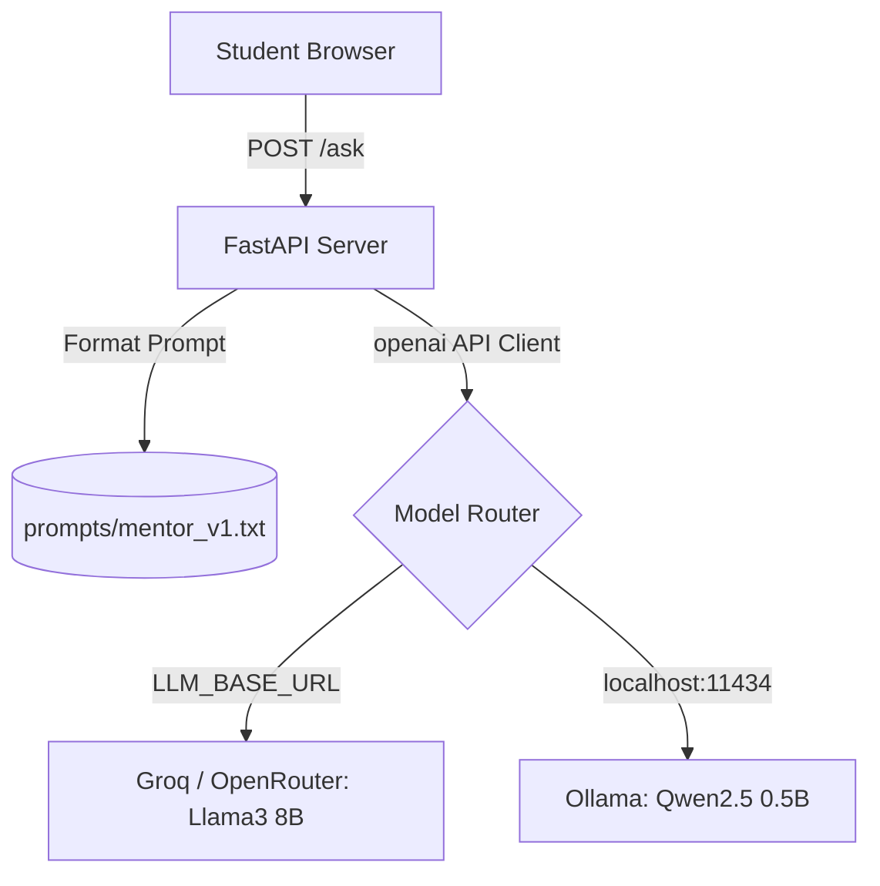

# Universal Exam Study Buddy

An open-weight AI mentor for competitive exams (SSC, Banking, UPSC). It diagnoses why a student got a question wrong, explains the examiner's trap, and provides speed tricks. 

Built with **FastAPI**, **TailwindCSS**, and **OpenAI-compatible endpoints** (like Groq, OpenRouter, or local Ollama).

## Demo
Check out the live app here: **[Live Link Placeholder]**

## Why Open-Weight Models?
This project transitioned entirely away from proprietary, closed-API models (like Gemini) to open-weight models (Llama 3 8B, Qwen 2.5). 
- **Offline Capability:** You can run it 100% locally on a laptop using Ollama and a 0.5B model.
- **Provider Agnostic:** Simply swap out the `LLM_BASE_URL` to use Groq, OpenRouter, HuggingFace, or a local server.
- **Privacy:** Student data and mistakes never have to leave their machine if self-hosted.

## Architecture


## Quick Start (Deploy in 5 minutes)

### Option A: Hosted (Vercel)
1. Get a free API key from [Groq](https://console.groq.com/keys) or [OpenRouter](https://openrouter.ai/).
2. Fork this repo and deploy to Vercel.
3. Add these 3 Environment Variables in Vercel:
   - `LLM_BASE_URL` (e.g., `https://api.groq.com/openai/v1`)
   - `LLM_API_KEY`
   - `LLM_MODEL` (e.g., `llama3-8b-8192`)
4. Deploy!

### Option B: Local / Offline (Ollama)
1. Install [Ollama](https://ollama.com/) and run `ollama pull qwen2.5:0.5b`
2. Clone this repo: `git clone ...`
3. Install dependencies: `pip install -r requirements.txt`
4. Set env vars:
   ```bash
   export LLM_BASE_URL=http://localhost:11434/v1
   export LLM_API_KEY=ollama
   export LLM_MODEL=qwen2.5:0.5b
   ```
5. Run: `uvicorn main:app --reload`

## Evaluations (Evals)
We measure our models against 15 competitive exam questions covering Math, Reasoning, English, and GK.

| Model | Structure Format Rate (%) | Avg Latency (s) |
|-------|---------------------------|-----------------|
| llama3-8b-8192 (Groq) | 100.0% | ~0.80s |
| qwen2.5:0.5b (Ollama) | ~70.0% | ~2.10s |
| llama3-70b-8192 (Groq) | 100.0% | ~1.20s |

*(Note: Small models under 3B parameters can sometimes hallucinate math steps. A warning is displayed in the UI when they are active).*

## Roadmap & Limitations
- **Limitations:** The UI assumes text-only input (no image OCR yet). Math formatting relies on basic markdown, not full LaTeX rendering. Small local models may fail at complex syllogism reasoning.
- **Roadmap:** Add image upload support (using an open multimodal model like LLaVA), and PDF test-paper ingestion.

## License
MIT License
